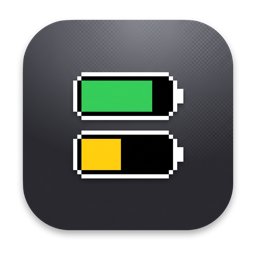
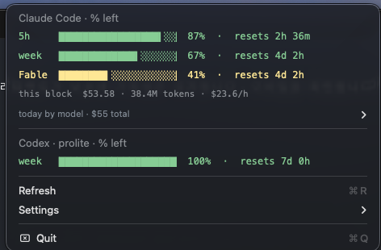
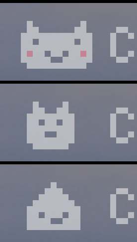

# 🔋 Claude & Codex Usage Battery

<p align="center">
  <a href="LICENSE"></a>
  
  
  
  
  
  <a href="https://github.com/dennykim123/claude-codex-battery/stargazers"></a>
</p>

> A menu-bar and system-tray widget that shows your remaining **Claude Code** and **Codex** usage limits as battery icons — so you never have to open `/usage` again.

<p align="center">
  
</p>

`C` = Claude · `X` = Codex. Each battery shows the **remaining %** of a limit window — full & green means plenty left, red means almost out. Click for a detailed breakdown with reset times.

Ships two ways: a **notarized native app** (double-click install, zero prerequisites) and a single [SwiftBar](https://github.com/swiftbar/SwiftBar) plugin — one self-contained script, **no third-party libraries**. The battery icons are rendered as PNGs from scratch in pure JavaScript (`node:zlib` only), so there's no image library and no `npm install`. Network calls: **two official usage endpoints** — Anthropic's and OpenAI's — each fetched with your own local Claude Code / Codex login (the same data `/usage` and Codex's `/status` show — [see Privacy](#privacy--security)), plus an **optional once-a-day update check** ([see Updating](#updating)). (`ccusage` is an optional extra for the cost breakdown.)

---

## What it shows

| Group | Batteries | Source |
|-------|-----------|--------|
| **`C` Claude** | 5-hour session · weekly · **Fable** (top-model weekly cap) | Anthropic's OAuth usage API — queried live with your local Claude Code login; **account-level**, so usage from every device/surface is included |
| **`X` Codex** | 5-hour · weekly (or credit balance on the premium plan) | Codex's account-level usage API (`backend-api/wham/usage`), queried live with your local Codex login — same data Codex CLI's `/status` shows; falls back to `~/.codex/sessions/**/*.jsonl` if offline |

Click the widget for a dropdown with, per limit:

```
Claude Code · % left
  5h    ▕█████████████████▍░░▏ 87%  ·  resets 2h 36m
  week  ▕█████████████▍░░░░░░▏ 67%  ·  resets 4d 2h
  Fable ▕████████▎░░░░░░░░░░░▏ 41%  ·  resets 4d 2h
  today by model · $55 total ▸

Codex · prolite · % left
  week  ▕████████████████████▏ 100% ·  resets 7d 0h
```

Colors follow a traffic-light scale: green ≥ 50 % left, amber < 50 %, red < 20 %.

---

## Requirements

> Using the **native app**? Skip this table — it has no prerequisites (Claude Code just needs to be logged in; `ccusage` optional). The table below is for the SwiftBar-plugin variant.

| | Required? | Install |
|---|---|---|
| **macOS** | ✅ | — |
| **[SwiftBar](https://github.com/swiftbar/SwiftBar)** | ✅ | `brew install swiftbar` |
| **[bun](https://bun.sh)** | ✅ | `curl -fsSL https://bun.sh/install \| bash` |
| **Claude Code** | ✅ for `C` batteries | just needs to be **logged in** on this Mac (the widget reuses its login to query the usage API) |
| **Codex CLI** | optional | for the `X` batteries; without it, only Claude is shown |
| **[ccusage](https://github.com/ryoppippi/ccusage)** | optional | adds the cost / token / per-model breakdown in the dropdown — **the battery works fully without it** |

> **Note:** This widget shows *your own account's* limits — via your local Claude Code login and your local Codex session logs. If you don't use Claude Code (or Codex), there simply won't be any data to display.

---

## Install

### Windows (experimental)

The native Windows 10/11 system-tray port lives in [`windows/`](windows/). It compiles with the .NET Framework tools included with Windows and requires no Node.js, package manager or Visual Studio installation.

```powershell
cd windows
.\install.ps1
```

See the [Windows documentation](windows/README.md) for optional start-at-login, privacy controls and uninstall instructions. Windows support is currently experimental; the macOS app remains the primary release.

### macOS

### Option 1 — Native app (no SwiftBar, no bun)

<p align="center">
  &nbsp;&nbsp;&nbsp;
  
</p>

Download `ClaudeCodexBattery-vX.Y.Z.dmg` from [**Releases**](https://github.com/dennykim123/claude-codex-battery/releases), open it, and drag `ClaudeCodexBattery.app` into **Applications**. That's it — the app is **signed & notarized**, so it runs with a double-click, and on first launch it offers to **start at login**. (A `.zip` is also published; it's what the in-app self-updater downloads.)

It's a native Swift port of the same widget: identical battery rendering, identical dropdown, same privacy model ([see Privacy](#privacy--security) — your tokens go only to the two usage endpoints). `ccusage` remains optional for the cost breakdown. Source lives in [`app/`](app/) — `./build.sh` for a local ad-hoc build, `./release.sh` for the notarized release.

**UI languages:** English · 한국어 · 日本語 · 简体中文 · 繁體中文 · Español — follows your system language, or pick one in **Settings → Language** (the SwiftBar plugin follows the same choice).

**Optional pixel mascot**  — **Settings → Cat** adds a tiny companion next to the batteries (off by default): a wide cat face with pink blush, a slim cat face, or an RPG slime. It emotes about your burn rate — asleep when idle, focused while you work, ears on fire during heavy burn, sweating when you're projected to hit 0% before the window resets, and sparkling when every battery is golden. The dropdown also gains a **🏁 lap row**: reach the 5-hour reset without running empty.

### Option 2 — SwiftBar plugin (single auditable script)

```bash
git clone https://github.com/dennykim123/claude-codex-battery.git
cd claude-codex-battery
./install.sh
```

`install.sh` will:

1. Verify **bun** and **SwiftBar** are present (and tell you how to install them if not)
2. Copy the plugin into `~/.swiftbar-plugins/`, rewriting the shebang to your machine's `bun` path *(SwiftBar runs plugins with a minimal `PATH`, so an absolute shebang is required)*
3. Point SwiftBar at the plugin folder and launch it
4. Install a launchd **KeepAlive** agent so SwiftBar comes back on its own — after a reboot, after sleep, and even if SwiftBar crashes (it occasionally does). The battery just stays there; you never have to relaunch it by hand. (To turn it off completely: `launchctl bootout gui/$(id -u)/com.dennykim.claude-codex-battery && osascript -e 'quit app "SwiftBar"'`.)

No `npm install`, no bundled libraries — the plugin is a single self-contained script.

The battery appears in your menu bar within a few seconds. It refreshes **every 2 minutes** (the `.2m.` in the filename).

### Manual install

If you prefer not to run the script:

```bash
mkdir -p ~/.swiftbar-plugins
# rewrite shebang to your bun path, then copy:
sed "1s|.*|#!$(command -v bun)|" claude-codex-usage.2m.js > ~/.swiftbar-plugins/claude-codex-usage.2m.js
chmod +x ~/.swiftbar-plugins/claude-codex-usage.2m.js
defaults write com.ameba.SwiftBar PluginDirectory -string ~/.swiftbar-plugins
open -a SwiftBar
```

---

## Updating

**Native app** — checks GitHub for a newer version once a day (a tiny request for the `VERSION` file). When one is out, a green **Install update** row appears in the dropdown: one click downloads the signed zip from Releases, **verifies its Developer ID code signature** (team-pinned, so a tampered zip is refused), replaces itself in place, and relaunches. Headless equivalent: `ClaudeCodexBattery.app/Contents/MacOS/ClaudeCodexBattery --self-update`.

**SwiftBar plugin** — the widget checks GitHub for a newer version **at most once a day** — a tiny background request for the `VERSION` file. When a new version is out, a green **🆕 update** row appears in the dropdown; click it to replace the plugin in place and refresh (your previous copy is kept as `.bak`). There's also an always-visible **⬆️ update now** row that replaces the plugin with the latest `main` on demand — no waiting for the daily check.

Prefer to do it yourself? From your clone: `git pull && ./install.sh`.

To turn the check off entirely, comment out the `getUpdateInfo()` call near the bottom of the script — then the only network call left is the Anthropic usage query.

---

## Privacy & security

- **Claude limits come straight from Anthropic.** The widget reads your Claude Code OAuth token from the macOS Keychain (item `Claude Code-credentials`) and calls `api.anthropic.com/api/oauth/usage` — the same endpoint `/usage` uses. The token is sent **only to api.anthropic.com**, passed via stdin (never visible in `ps`), and never written to disk or logs. macOS may show a one-time Keychain permission prompt — click **Always Allow**. (Clicking *Deny* makes macOS re-prompt on every refresh — if you'd rather the widget never touch the Keychain, run `touch ~/.claude/swiftbar/.no-live` instead; it then reads local cache files only, like v1.1.)
- **Codex limits come straight from OpenAI.** Likewise, the widget reads your Codex OAuth token from `~/.codex/auth.json` and calls `chatgpt.com/backend-api/wham/usage` — the same account-level endpoint Codex CLI polls itself. The token is sent **only to chatgpt.com**, via stdin (never visible in `ps`), and never written to disk or logs. (`touch ~/.claude/swiftbar/.no-live` disables both live queries; it then reads local files only.)
- **No API keys touched.** Only the OAuth login tokens above are read — never any `OPENAI_API_KEY` / `ANTHROPIC_API_KEY`.
- **No usage data leaves your machine.** Nothing is uploaded anywhere; the only outbound calls are the two usage queries above (to Anthropic and OpenAI) and the optional daily update check ([Updating](#updating)).
- **No conversation content.** From the Codex session-log fallback it parses only the `rate_limits` object (numbers), never the messages.
- **Auditable in one sitting.** The whole widget is a single dependency-free script — grep for `curl`/`fetch` and you've seen every network call it can make.

---

## How accurate / in-sync is it?

**Claude — live.** Every refresh queries Anthropic's usage API directly with your local Claude Code login — the *same* server-side data `/usage` shows, so the numbers match it by construction. Because the limits are **account-level**, usage from every surface and device (terminal, desktop app, web, another machine) is already included. If the query fails (offline, logged out), the widget falls back to its last successful response and labels the reading with its age in amber.

**Codex — live too.** The widget queries the same account-level usage endpoint Codex CLI polls internally (`backend-api/wham/usage`), using your local Codex login token. It's a read-only call that costs **no tokens**, and because it's account-level, all your machines see the *same* numbers — so two Macs stay in sync. If the query fails (offline, logged out), it falls back to the newest local session log (labeled "measured N ago", warns past 3h) and then to its last live response.

**TL;DR** — Both Claude and Codex are live and account-level, so every device shows the same numbers. When a live query fails, each falls back to a clearly-labeled cached/snapshot reading.

---

## How it works

The whole thing is one `.js` file run by bun on a timer.

- **Battery icons** are drawn pixel-by-pixel into an RGBA buffer and encoded to PNG using only `node:zlib` (hand-rolled CRC32 + IHDR/IDAT/IEND chunks). A 5×7 bitmap font renders the numbers and the `C`/`X` group labels. SwiftBar displays the PNG at pixels ÷ 2 pt.
- **Claude limits** are fetched from Anthropic's OAuth usage endpoint using the Claude Code login token in your Keychain, with the last good response cached at `~/.claude/swiftbar/.claude-usage.json` as an offline fallback. The Fable cap is the `weekly_scoped` entry.
- **Codex limits** are fetched live from `backend-api/wham/usage` with the token in `~/.codex/auth.json`, normalized to the same shape as the session-log format, and cached at `~/.claude/swiftbar/.codex-usage.json` as an offline fallback (with the newest session log as a second fallback). The premium plan reports a `credits` object instead of percentages when exhausted; the widget handles both shapes.

Both queries are read-only and cost **no tokens** — you never have to *use* Claude or Codex to get a fresh reading, and every device sees the same account-level numbers. Older builds refreshed Codex by quietly running a real `codex` command in the background (spending tokens) when the session-log value went stale; that's gone — the live endpoint makes it unnecessary.

---

## Customizing

| Want to change | Where |
|---|---|
| Refresh interval | filename `.2m.` → `.1m.`, `.5m.`, `.30s.`, … |
| Battery size | **↕ row in the dropdown** — toggles between big (4×6 font, default) and small (3×5 font, ~25% narrower); stored in `~/.claude/swiftbar/.batt-size` |
| Color thresholds | `heatRemain` / `heatRemainHex` (20 % / 50 %) |
| Disable live Claude + Codex APIs (Keychain / token access) | `touch ~/.claude/swiftbar/.no-live` (falls back to local cache files) |
| Which Claude limits to show | the `battItems.push(...)` block |

---

## App or plugin — which one?

Both variants show exactly the same batteries and dropdown, from the same two usage endpoints.

- **Native app** — one notarized `.app`, zero prerequisites, double-click and done. For anyone who just wants the battery in the menu bar (this was the roadmap item; it shipped in v2.0.0).
- **SwiftBar plugin** — one self-contained script, easy to audit in a sitting and trivial to fork. Its audience (Claude Code / Codex developers) already lives in the terminal, so `brew install swiftbar` is no barrier.

## Contributing

Issues and PRs welcome — especially for other plans/tools (e.g. mapping additional `rate_limit` shapes, or adding providers). Keep it dependency-free.

## License

[MIT](LICENSE)
