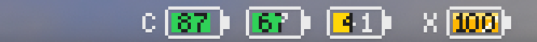

# 🔋 Claude & Codex Usage Battery

<p align="center">
  <a href="LICENSE"></a>
  
  
  
  
  <a href="https://github.com/dennykim123/claude-codex-battery/stargazers"></a>
</p>

> A macOS menu bar widget that shows your remaining **Claude Code** and **Codex** usage limits as battery icons — so you never have to open `/usage` again.

<p align="center">
  
</p>

`C` = Claude · `X` = Codex. Each battery shows the **remaining %** of a limit window — full & green means plenty left, red means almost out. Click for a detailed breakdown with reset times.

Built as a single [SwiftBar](https://github.com/swiftbar/SwiftBar) plugin — one self-contained script, **no third-party libraries**. The battery icons are rendered as PNGs from scratch in pure JavaScript (`node:zlib` only), so there's no image library and no `npm install`. The only network call is an **optional once-a-day update check** ([see Updating](#updating)) — disable it and the widget makes none at all. (`ccusage` is an optional extra for the cost breakdown.)

---

## What it shows

| Group | Batteries | Source |
|-------|-----------|--------|
| **`C` Claude** | 5-hour session · weekly | `rate_limits` from Claude Code's statusline feed, cached by an installed hook ([details](#how-it-works)) |
| **`X` Codex** | 5-hour · weekly (or credit balance on the premium plan) | `~/.codex/sessions/**/*.jsonl` → `rate_limits` |

Click the widget for a dropdown with, per limit:

```
Claude Code
  5h remaining   ▕██████████████░░░░░░▏ 70%  (used 30%)  · resets 3h 18m
  weekly         ▕██████▋░░░░░░░░░░░░░▏ 33%  (used 67%)  · resets 3d 21h
  today by model ▕████████████▏ Fable $75 · Opus $46 · Sonnet $5 …

Codex · prolite
  5h remaining   ▕████████████████████▏ 100% (used 0%)
  weekly         ▕████████████████▋░░░▏ 83%  (used 17%)
```

Colors follow a traffic-light scale: green ≥ 50 % left, amber < 50 %, red < 20 %.

---

## Requirements

| | Required? | Install |
|---|---|---|
| **macOS** | ✅ | — |
| **[SwiftBar](https://github.com/swiftbar/SwiftBar)** | ✅ | `brew install swiftbar` |
| **[bun](https://bun.sh)** | ✅ | `curl -fsSL https://bun.sh/install \| bash` |
| **Claude Code** | ✅ for `C` batteries | `install.sh` hooks into your statusline to cache the rate-limit data ([details](#how-it-works)) |
| **Codex CLI** | optional | for the `X` batteries; without it, only Claude is shown |
| **[ccusage](https://github.com/ryoppippi/ccusage)** | optional | adds the cost / token / per-model breakdown in the dropdown — **the battery works fully without it** |

> **Note:** This widget reads *your own local usage files*. If you don't use Claude Code (or Codex), there simply won't be any data to display.

---

## Install

```bash
git clone https://github.com/dennykim123/claude-codex-battery.git
cd claude-codex-battery
./install.sh
```

`install.sh` will:

1. Verify **bun** and **SwiftBar** are present (and tell you how to install them if not)
2. Copy the plugin into `~/.swiftbar-plugins/`, rewriting the shebang to your machine's `bun` path *(SwiftBar runs plugins with a minimal `PATH`, so an absolute shebang is required)*
3. Wire the **rate-limit cache hook** into Claude Code's statusline (`~/.claude/settings.json`) — Claude Code only exposes rate limits to the statusline command, so the hook caches them for the widget and passes your existing statusline through untouched (a backup of `settings.json` is kept as `.ccb-bak`)
4. Point SwiftBar at the plugin folder and launch it
5. Register SwiftBar as a login item, so the battery comes back automatically after a reboot

No `npm install`, no bundled libraries — the plugin is a single self-contained script.

The battery appears in your menu bar within a few seconds. It refreshes **every 2 minutes** (the `.2m.` in the filename).

### Manual install

If you prefer not to run the script:

```bash
mkdir -p ~/.swiftbar-plugins
# rewrite shebang to your bun path, then copy:
sed "1s|.*|#!$(command -v bun)|" claude-codex-usage.2m.js > ~/.swiftbar-plugins/claude-codex-usage.2m.js
chmod +x ~/.swiftbar-plugins/claude-codex-usage.2m.js
defaults write com.ameba.SwiftBar PluginDirectory -string ~/.swiftbar-plugins
open -a SwiftBar
# wire the Claude rate-limit cache hook into your statusline:
cp ccb-limits-cache.js ~/.swiftbar-plugins/.ccb-limits-cache.js
bun ~/.swiftbar-plugins/.ccb-limits-cache.js --install
```

---

## Updating

The widget checks GitHub for a newer version **at most once a day** — a tiny background request that is the *only* network call it ever makes. When a new version is out, a green **🆕 update** row appears in the dropdown; click it to replace the plugin in place and refresh (your previous copy is kept as `.bak`).

Prefer to do it yourself? From your clone: `git pull && ./install.sh`.

To turn the check off entirely, comment out the `getUpdateInfo()` call near the bottom of the script — then the widget makes **zero** network calls.

---

## Privacy & security

- **No usage data leaves your machine.** Limits are read from local files and rendered locally; the only network call is the optional daily update check above.
- **No secrets read.** It never touches `auth.json`, credentials, or keychains.
- **No conversation content.** From Codex session logs it parses only the `rate_limits` object (numbers), never the messages.
- Usage values are read at runtime — **nothing is baked into the code**, so sharing the script shares no data.

---

## How accurate / in-sync is it?

**Claude — live while you use Claude Code.** The limits are the *same* rate-limit data Claude Code shows in `/usage`: Claude Code pipes them to your statusline, the installed hook caches them, and the widget reads the cache every 2 min. While a Claude Code session is open the numbers track `/usage` in real time; when no session is running, the widget shows the last measured values (labeled "measured N ago" in the dropdown).

**Codex — as fresh as your last Codex run.** Codex writes rate-limit data to its session logs *only while you use it*, and records no reset time. So the value is a snapshot from your most recent session — the dropdown labels it "measured N ago" and warns past 3h. Run Codex and it re-syncs instantly.

**TL;DR** — Claude is live while Claude Code runs (same source as `/usage`); Codex is a clearly-labeled snapshot from your last session, not a live feed.

---

## How it works

The whole thing is one `.js` file run by bun on a timer.

- **Battery icons** are drawn pixel-by-pixel into an RGBA buffer and encoded to PNG using only `node:zlib` (hand-rolled CRC32 + IHDR/IDAT/IEND chunks). A 5×7 bitmap font renders the numbers and the `C`/`X` group labels. SwiftBar displays the PNG at pixels ÷ 2 pt.
- **Claude limits** come from the statusline: Claude Code pipes `rate_limits` (5-hour / weekly used % + reset times) to the configured `statusLine` command — its **only** programmatic outlet for this data. `install.sh` wires in a small hook (`.ccb-limits-cache.js`) that writes them to `~/.claude/swiftbar/usage-cache.json` and then runs your original statusline unchanged. The `CF` (top-model weekly) battery appears only if your cache carries a model-scoped `weekly` entry — the statusline feed currently exposes just the two plan-wide windows.
- **Codex limits** come from the newest session's `rate_limits`. The premium plan reports a `credits` object instead of percentages when exhausted; the widget handles both shapes.

### Codex has one quirk

Codex only writes limit data to session logs **while you use it**, and doesn't record a reset time when exhausted. So if you haven't run Codex in a while, the value can be stale. The widget:

- flags values older than 3 hours in the dropdown, and
- **optionally** runs `codex exec --sandbox read-only` in the background to refresh — but *only* when Codex is exhausted **and** the value is 2h+ old, at most once every 6 hours (≈4×/day, ~20k tokens each).

If you'd rather it never spend tokens on its own, comment out the `maybeAutoRefreshCodex(codex)` call near the render section.

---

## Customizing

| Want to change | Where |
|---|---|
| Refresh interval | filename `.2m.` → `.1m.`, `.5m.`, `.30s.`, … |
| Battery size | `drawCapsule`: `bw` / `bh` (5×7 font sets the floor) |
| Color thresholds | `heatRemain` / `heatRemainHex` (20 % / 50 %) |
| Disable Codex auto-refresh | comment out `maybeAutoRefreshCodex(codex)` |
| Which Claude limits to show | the `battItems.push(...)` block |

---

## Why a SwiftBar plugin (and not a standalone app)?

A single script stays dependency-free, easy to audit, and trivial to fork — and its audience (Claude Code / Codex developers) already lives in the terminal, so `brew install swiftbar` is no barrier. A native `.app` would drop the SwiftBar requirement but adds a Swift codebase, Apple code-signing + notarization ($99/yr), and ongoing maintenance. **Roadmap:** if there's enough demand, ship a signed one-click menu-bar `.app` (likely bundling SwiftBar) for non-terminal users.

## Contributing

Issues and PRs welcome — especially for other plans/tools (e.g. mapping additional `rate_limit` shapes, or adding providers). Keep it dependency-free.

## License

[MIT](LICENSE)
