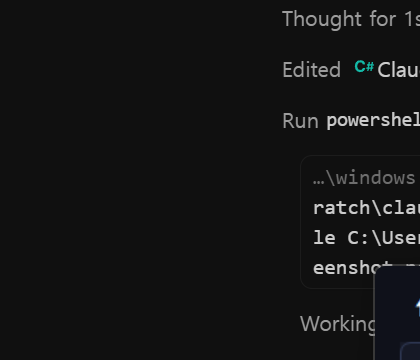

# Windows app (experimental)

The Windows port is a dependency-free WinForms system-tray application for Windows 10/11. It is built from the auditable C# source with the .NET Framework compiler included with Windows.



## What it shows

- Claude 5-hour and weekly remaining percentages from Anthropic's OAuth usage endpoint.
- Codex 5-hour and weekly remaining percentages from ChatGPT's account usage endpoint.
- Clearly labeled session-log or cached values when a live Codex request is unavailable.
- A compact tray icon and flyout; disconnected services and unavailable windows are hidden.
- A draggable flyout that remembers its last position, with independent **Keep window open** and **Always on top** options.

The app never invents fallback percentages. A missing or unrecognized response is shown as unavailable.

## Install

From PowerShell in this directory:

```powershell
.\install.ps1
```

This compiles and installs the app to `%LOCALAPPDATA%\ClaudeCodexBattery`, then launches it. Start-at-login is off by default. Enable it from the tray Settings menu, or during installation:

```powershell
.\install.ps1 -EnableAutoStart
```

Use `-NoLaunch` to build and install without starting the app. Reinstallation preserves the existing start-at-login preference; pass `-DisableAutoStart` to turn it off explicitly.

## Privacy

For live usage, the app reads the existing Claude Code login from `%USERPROFILE%\.claude\.credentials.json` and the existing Codex login from `%USERPROFILE%\.codex\auth.json`. OAuth tokens are sent only to:

- `https://api.anthropic.com/api/oauth/usage`
- `https://chatgpt.com/backend-api/wham/usage`

Tokens are not written to the app's cache. Successful usage responses are cached under `%USERPROFILE%\.claude\swiftbar` for offline display. Create `%USERPROFILE%\.claude\swiftbar\.no-live` to disable both live requests and credential access.

## Uninstall

```powershell
.\uninstall.ps1
```

The default uninstaller stops the app, removes the login-start entry and deletes the installed executable. To also remove Windows-specific cached usage and the selected skin:

```powershell
.\uninstall.ps1 -RemoveCachedUsage
```

## Development

The app targets C# 5 and uses only .NET Framework assemblies. Pull requests run a Windows build plus fixture-based parser tests. Do not commit compiled `.exe` files.
